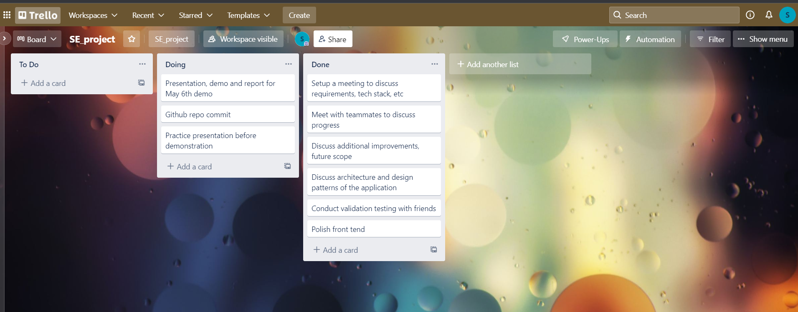

# CS5704-ToDo-App
Project for the Software Engineering course CS5704-Spring'22

## Project Description
The Todo app will help software engineers organize their thoughts by prioritizing their work. It will also help categorize the type of work which will give the user a coherent idea of the tasks remaining. The Todo app will help the user in decluttering their thoughts and providing them with a sense of achievement, helping them improve their productivity.

## Project Members
* [Disha Bhan](https://github.com/Disha2494)
* [Ashish Bhat](https://github.com/ashishbhat21)
* [Sahana Basapathi](https://github.com/sahana-bs)

## To run the project following dependencies should be installed.
```
1: pip3 install pipenv
```
```
1: pipenv install django==3.2.8
```
```
1: pipenv install psycopg2==2.9.1
```
```
1: pipenv install dj-database-url==0.5.0
```
```
1: pipenv install sqlparse==0.4.2
```
```
1: pipenv install whitenoise==5.3.0
```
```
1: pipenv install pytz==2021.3
```
```
1: pipenv install gunicorn==20.1.0
```
## Instructions to run the app
### The backend server will run on: http://127.0.0.1:8000
```
python manage.py runserver
```
### To sync the database with the current state of any database models run the following commands:
```
python manage.py makemigrations
```
```
python manage.py migrate
```

## Instructions to run the tests
```
python manage.py test
```

## Instructions to run a use case
* To create a task
* Navigate to the create page by clicking on the "new task" option in the navigation bar.


#This redirects you to task detail page when you can see the details of the task.
.jpeg)

#The new task is reflected in the dashboard (pending task section).


## Task management tool
For this project, we have used trello as a task management tool. Here's a sneak peek to one of our task boards. 

